```mermaid
flowchart TD
	A[Introducción] --> B[App sencilla]
	B --> C[CI/CD]
	C --> D[Dockerización]
	D --> E[Kubernetes en tu PC]
	E --> F[Desplegando en Kubernetes]
	F --> G[Explorando el clúster]
	G --> H[Configuración y persistencia]
	H --> I[Pruebas y monitoreo]
	I --> J[Buenas prácticas y producción]
	J --> K[Proyecto Final]
```
	

# 🚀 Curso: Kubernetes de Cero a Pro

---

<h2 align="center">🗺️ Roadmap del Curso</h2>

	

<h2 align="center">Curso práctico y guiado para aprender Kubernetes desde cero</h2>

Ideal para quienes tienen conocimientos mínimos o nulos en desarrollo y DevOps. 
Aprenderás a crear una app sencilla, dockerizarla, desplegarla y gestionarla en Kubernetes, con ejemplos claros y ejercicios prácticos. 
<b>¡Incluye ejercicios interactivos y proyecto final!</b>

---

---

<h2 align="center">📝 Prerrequisitos</h2>

Antes de iniciar el curso, asegúrate de cumplir con los siguientes requisitos y de instalar las herramientas recomendadas. ¡No necesitas experiencia previa en Kubernetes ni DevOps!

- **Curiosidad y ganas de aprender**
- **Conocimientos básicos de terminal o línea de comandos** (copiar, pegar, navegar carpetas)
- **Conocimientos básicos de programación** (Python recomendado, pero no obligatorio)
- **Conocimientos básicos de redes** (qué es una IP, puerto, etc.)
- **Computadora con acceso a Internet**
- **Permisos de instalación de software en tu equipo**
- **Espacio en disco suficiente** (recomendado al menos 5GB libres)
- **Sistema operativo:** Windows, macOS o Linux
- **Navegador web actualizado** (Chrome, Firefox, Edge, etc.)
- **Cuenta gratuita en Docker Hub** (para subir imágenes, opcional pero recomendado)
- **Visual Studio Code** (o cualquier IDE de tu preferencia)

---

<h2 align="center">🛠️ Herramientas necesarias</h2>

- [Docker Desktop](https://docs.docker.com/get-docker/) — Guía oficial para instalar Docker.
- [kubectl](https://kubernetes.io/docs/tasks/tools/) — Instalador oficial de la CLI de Kubernetes.
- [Minikube](https://minikube.sigs.k8s.io/docs/start/) o [Kind](https://kind.sigs.k8s.io/docs/user/quick-start/) — Para simular Kubernetes localmente.
- [Python 3.x](https://www.python.org/downloads/) — Recomendado para el desarrollo de la app de ejemplo.
- [Visual Studio Code](https://code.visualstudio.com/download) — Editor de código recomendado.

> **Opcional:** Cuenta gratuita en [GitHub](https://github.com/join) para descargar recursos y compartir avances.

---

---

<h2 align="center">📚 Índice General</h2>

### Módulo 1: Introducción
1. ¿Qué es Kubernetes y por qué aprenderlo?
2. ¿Qué son los contenedores? Introducción a Docker
3. Instalando Docker y herramientas necesarias

### Módulo 2: Creando tu primera app sencilla
1. Instalando Python y Flask
2. Creando una API sencilla de notas (backend)
3. Creando el frontend básico en HTML/CSS
4. Prueba local de la aplicación

### Módulo 3: Integración y Entrega Continua (CI/CD)
1. ¿Qué es CI/CD?
2. Beneficios de CI/CD
3. Herramientas populares
4. Ejemplo básico de pipeline

### Módulo 4: Dockerización
1. ¿Qué es Docker y para qué sirve?
2. Creando un Dockerfile para el backend
3. Dockerizando el frontend (opcional)
4. Creando imágenes y probando contenedores localmente
5. Docker Compose para desarrollo local

### Módulo 4: Kubernetes en tu PC
1. ¿Qué es Kubernetes? Conceptos clave
2. Instalando Minikube (o Kind)
3. Primeros comandos con kubectl
4. Estructura de un manifiesto YAML en Kubernetes

### Módulo 5: Desplegando en Kubernetes
1. Desplegando el backend en Kubernetes
2. Exponiendo el backend con un Service
3. Desplegando el frontend
4. Accediendo a la app desde el navegador

### Módulo 6: Explorando el clúster
1. Listando y revisando pods y servicios
2. Logs y acceso a contenedores
3. Simulando fallos y observando la resiliencia
4. Escalado manual y automático (HPA)

### Módulo 7: Configuración y persistencia
1. ConfigMaps y Secrets para variables y contraseñas
2. Introducción a Volumes y persistencia de datos
3. Base de datos Postgres en el clúster
4. Conexión backend-base de datos usando ConfigMaps/Secrets

### Módulo 8: Pruebas reales y monitoreo
1. Readiness y Liveness Probes
2. Instalando métricas y monitoreo (Prometheus, Grafana)
3. Simulación de actualizaciones (Rolling Updates)

### Módulo 9: Buenas prácticas y producción
1. Limpieza y organización de manifiestos
2. Introducción a Helm
3. Seguridad básica en Kubernetes
4. Opciones para desplegar en la nube

---

<h2 align="center">🏆 Proyecto Final</h2>

- Despliegue completo de la app de notas con frontend, backend y base de datos en Kubernetes, con configuración y monitoreo básicos.

---

---

<h2 align="center">🔗 Recursos adicionales</h2>

- Glosario de términos
- Enlaces a documentación oficial y tutoriales recomendados
- Preguntas frecuentes y tips para entrevistas técnicas

---

---

<h2 align="center">⏰ Sugerencia de duración por módulo (clase en vivo)</h2>

Estas son horas estimadas para dictar cada módulo, incluyendo teoría, demos y ejercicios prácticos:

| Módulo | Duración estimada |
|--------|-------------------|
| 1. Introducción | 1 hora |
| 2. App sencilla | 1.5 horas |
| 3. CI/CD | 1 hora |
| 4. Dockerización | 1.5 horas |
| 5. Kubernetes en tu PC | 1.5 horas |
| 6. Desplegando en Kubernetes | 1.5 horas |
| 7. Explorando el clúster | 1 hora |
| 8. Configuración y persistencia | 1.5 horas |
| 9. Pruebas y monitoreo | 1 hora |
| 10. Buenas prácticas y producción | 1 hora |
| Proyecto final y repaso | 2 horas |

<b>Total estimado: 13-14 horas (ajustable según el ritmo y participación del grupo).</b>

